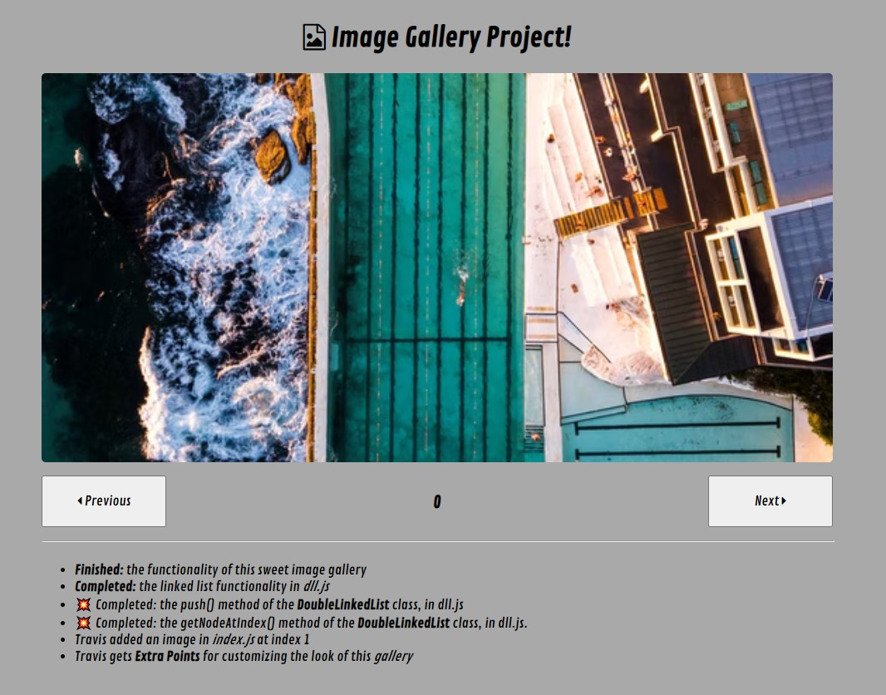

# Image Carousel

- in this projects I added doubly linked list functions and some styling
- vanilla JavaScript, CSS, and HTML
- I figured out how to get, insert, and delete nodes at indexes
- most of the css and html was done for me, and I added most of the logic
--------------------------------------------------------------------------
[Image Carousel](https://image-crousel-mgqdju.stackblitz.io/)
